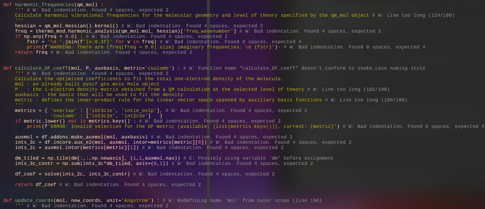

# Python resources

Here is some thoughts, resources and tutorials on some python good
practices we should use in our projects.

For most of the advice I give here there is plentiful resources
online. I'll try to put some links, but if I don't I will at least
use correct terminology that you can use to search.

The main philosophy here is [code is read more than it is
written](https://primalskill.blog/code-is-read-more-than-it-is-written).
So it is as much important to have working code as to have readable
code. And when it is exceptionnally the case that we cannot make the
code "readable" (as when building custom complex computation
algorithms), we comment and document.

## Why use exceptions

So, I'll take an example inspired from the PySCF and TREXIO
[(line 166 at the time of writing in the script of Giovanni in the trexio-test
repo)](https://github.com/srampinogroup/trexio-test/commit/4c73c70f9c69dc55d3d422508e1b2f3291039f4b#diff-605a680a0dd850224ebb63564714fd8c892478265a71680afbd3fcc5fd1fe3cb)
as base exercise.

In the script we see this pattern:
```python
if isinstance(mol_ref, gto.mole.Mole) and isinstance(mol_2al, gto.mole.Mole) :
  xyz_ref = mol_ref.atom_coords(unit)
  xyz_2al = mol_2al.atom_coords(unit)
else :
  print("WARNING: The 'mol_ref' and 'mol_2al' arguments must be None or a pyscf.gto.mole.Mole objects, current types are {type(mol_ref)} and {type(mol_2al}")
  return np.empty(3,3), float('NaN')
```

Since after the warning the code returns an invalid value, we know that anything
done after will be useless, so it is actually an error. Let's take a
simpler example showing the same use of return value for compute a
rounded percentage. What should we return when the divisor is zero?
```python
def compute_percentage(a: float, b: float) -> int:
  if b == 0:
    return ?

  return int(a / b * 100)
```
first, we could think: ok, let's return "Not a Number" (NaN), but it
would violate our contract where we say we return an int. The script
will work (see below in Type hints sections), but the fact that we
said we were retuning an int is now a lie. And again, code is read
more than it is written, so we should not lie.

So the answer is: we cannot have a return value if the divisor is
zero. So the only way is to fail, and raise an exception. For
example:
```python
def compute_percentage(a: float, b: float) -> int:
  if b == 0:
    raise ZeroDivisionError("b must be positive")

  return int(a / b * 100)
```
That could actually be entirely replaced by just `int(a / b * 100)`
because if you try you'll see it will also error on division by zero.

Important point that was raised: why don't we need a return value?
Well that is the whole point of exceptions: this is an exceptional
case, if we do not handle the error, every functions call since the
begining will be halted. To be clear, everything is skipped when
using exception up until a try statement or the main program:
```python
def a() -> str:
  raise Exception("In a")
  return "line never reached"

def b() -> str:
  var a_return_value = a()
  # a_return_value does not have a value
  return "line never reached either"

def c() -> str:
  var b_return_value = b()
  # b_return_value does not have a value
  return "line still never reached."

print(c()) # will print nothing, line never reached.
# Since we do not handle the exception, the terminal will print
# Exception line # in file script.py: "In a"
```

So now the program will stop if we do not handle the error (and
generally in scripts we want that).
But now, what if there is an error, and I want to handle it? Because
a lot of times, we have errors that do not come from our code. So we
use the try except pattern:

```python
try:
  var percent := compute_percentage(8.0, 0.0)
            # ^ this is to assign the type int to the variable
except ZeroDivisionError as e:
  print_in_red(e)
  save_file()
  clean_temp_files()
  ...
  raise
```
Of course this is a silly example, we could just do a big
`sys.exit(1)` if we have nothing to clean up, but now anyone using
our code will not be able to handle the error and will have to suffer
the crash. Exceptions should not be used as control flow, but at
least you have to option to do so. So now the exception will rise up
from function calls to function calls up until the try statement, and
jump directly to the except statement, and `percent` will not have a
value.

Just for reference hhe whole try pattern is as follows, but we seldom
use it in its complete form except maybe in the main block to ensure
every file is closed etc.
```python
try:
  # Code that might raise an exception
except SomeException:
  # Code to handle SomeException
except SomeOtherException:
  # Code to handle SomeOtherException
else:
  # Code to run only if no exception occurs
finally:
  # Code to run regardless of whether an exception occurs
```

Now going back to the PySCF script, the most important question to
ask oneself is this: if I put a warning, does it makes sense for the
program to continue with the value I returned? Can the program
actually do the computation when the returned value is
`np.empty(3,3), float('NaN')`? If not, then it should not be a
warning, and nothing should be returned. If is does makes sense
(like, the computation is only partially converged but the program
can continue by doing a bad approximation) and can be desirable
during tests for example, then we do a warning.

## What if I actually want a warning?

See this answer on stackoverflow: [https://stackoverflow.com/a/49456279/2261265](https://stackoverflow.com/a/49456279/2261265).

## Note on assertions (advanced, do not worry too much about it)

Sometimes we want to make sure something never happens. Not
exceptionally. Never. For this, we use assertions. They are generally
removed by compilers in various languages for production ready code
because like I said, this should never happen. Bu, it is still useful
to have while in development. First, for unit testing. I will not try
to detail what are unit tests here, but imagine you have the
stupidest user always running your scripts while putting the most
inimaginable rubbish input in them while all the same using it
normally from time to time. That what unit tests are ideally. Awful
but thorough users. So if you know you have a positive number of
atoms, then you can do in your code:
```python
assert number_of_atoms > 0, "Number of atom is zero or negative!"
```
So now, next you see this happening, you know you changed something
you should not have. Unit tests are the industrial version of that.

But, while in dev phase, it can be really useful. For example, if you
have to parse a file, that you know is a `.xyz` file, you checked the
extension etc. Turns out the first line is not conform to the format,
because you messed up your ViM commands while saving. Here an assert
can be considered: after all, trusting someone to respect to XYZ
format is ok. But trusting yourself while you debug? Nope.

So a sensible thing to add in your code (while in dev mode, I say
again), is something like this (with some exception handling as a
bonus, and how to print to stderr):
```python
import sys
def parse_xyz(path: str) -> MyXYZObject:
  with open(path, "r", encoding="utf8") as read_file:
    line = file.read_line()
    try:
      num_atom = int(line)
      assert(num_atom > 0) # will hard fail if num_atom is not > 0
    except ValueError as verr:
      print("Encontered exception while parsing.", file=sys.stderr)
      print(verr, file=sys.stderr)
```

### with?

You might have noticed the use of `with`. It is actually a shortcut
for `try ... finally`. Let me explain. You can catch exception and do
nothing with them, except (I swear puns not intended) still using the
`finally` clause. Look at these exemples:
```python
f = trexio.File("file.hdf", "r")
...
f.close()
```
Good. but if while reading something happens, as I explained earlier,
an exception would occur and then, no `close()`. And that is dirty.
You do not want opened file descriptors. Nowadays it is almost always
*not* a problem because OSs have progressed a lot, but while working
on Arduino or clusters with other users, you want to be careful with
that. So what we can do is using the `try ... finally` snippet I
showed earlier:
```python
try:
  f = trexio.File("file.hdf", "r")
  do_whatever(f)
except Something:
    # Yes, we could care about that here
finally:
  # But we don't care about errors, we JUST care about closing the
  # file. This will execute whatever happens.
  f.close()
```
And that is exactly what this does, with a bit less of boilerplate:
```python
with trexio.File("file.hdf", "r") as f:
  do_whatever(f)
```
Like in many other languages, `with` is just `try ... finally`.

## Type hints

Look at this cheat sheet for python type hintings:
[https://mypy.readthedocs.io/en/stable/cheat_sheet_py3.html](https://mypy.readthedocs.io/en/stable/cheat_sheet_py3.html),
but don't get to obsessed with it, it covers some extreme cases.
To use correct types at declaration just use the walrus operator and
it guesses the correct type:
```python
# You don't need to do this:
var i: int = 5
var a: np.ndarray = np.array([1, 2, 3, 4])
# This is equivalent:
var i := 5
var a := np.array([1, 2, 3, 4])
```
They are more important on function parameters and return values,
because these document how to use the function.

## Why use a linter

I'll be brief on that because there is a lot of resources on
internet but I can add more info if needed. This is just how it looks
like on my vim when editing code:


The simplest way to use a linter, is just that:
```bash
pip install pylint
pylint script.py
```
And it will output a report. If you think you want/need to have it
integrated in your editor, look it up here:

[vim-ale](https://github.com/dense-analysis/ale)

[Example of installation of ALE/pylint in vim](https://stackoverflow.com/questions/56614721/how-to-correctly-enable-pylint-with-ale-in-vim)

[More info on linters](https://codilime.com/blog/python-code-quality-linters/)
